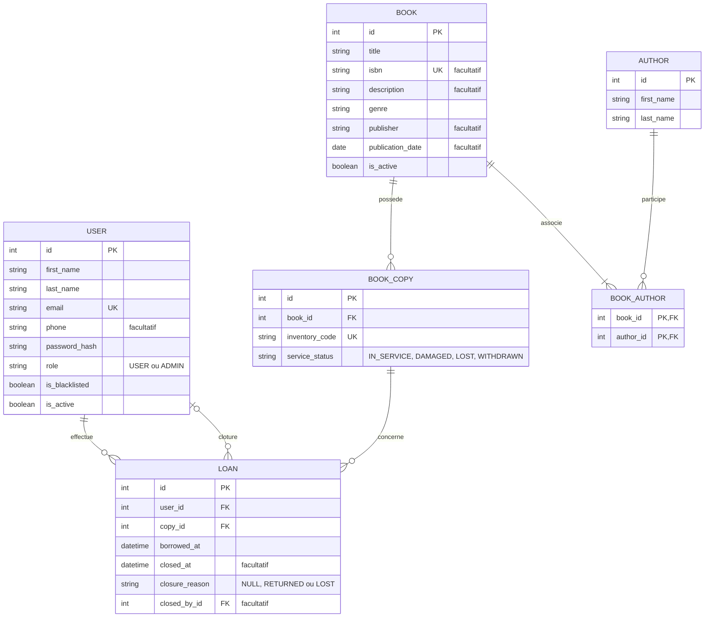

# Modélisation de la bibliothèque

## Principes

Un livre représente une édition. Chaque exemplaire physique est identifié par
un numéro d'inventaire unique. Plusieurs exemplaires partagent la même fiche ;
deux éditions d'un titre possèdent des fiches distinctes.

Un emprunt concerne un exemplaire précis. Les quantités sont calculées depuis
les exemplaires et les emprunts en cours, sans compteur de stock enregistré.
Un livre peut avoir plusieurs auteurs grâce à l'association `BookAuthor`.

## MCD : entités et cardinalités

| Entité | Attributs conceptuels |
| --- | --- |
| Utilisateur | identifiant, prénom, nom, email, téléphone, mot de passe haché, rôle, liste noire, actif |
| Auteur | identifiant, prénom, nom |
| Livre | identifiant, titre, ISBN facultatif, description, genre, éditeur, date de publication, actif |
| Exemplaire | identifiant, numéro d'inventaire, état de service |
| Emprunt | identifiant, date de début, date de clôture, motif de clôture |

- Un utilisateur effectue **0 à N** emprunts ; chaque emprunt appartient à **1** utilisateur.
- Un livre possède **0 à N** exemplaires ; chaque exemplaire appartient à **1** livre.
- Un exemplaire fait l'objet de **0 à N** emprunts dans le temps ; chaque emprunt concerne **1** exemplaire.
- Un auteur participe à **0 à N** livres ; un livre possède **1 à N** auteurs.
- Un emprunt clôturé est clôturé par **1** utilisateur ; un utilisateur peut clôturer **0 à N** emprunts selon ses droits.

## MLD : tables et clés



Les tables physiques sont `users`, `authors`, `books`, `book_authors`,
`book_copies` et `loans`. Les identifiants sont générés par Oracle ;
`book_authors` utilise une clé primaire composée.

Le nom de famille est obligatoire à l'inscription. Il peut rester absent pour
les comptes anciens dont l'identité n'a pas encore été complétée.

## Contraintes

- Email obligatoire, normalisé et unique.
- Rôle limité à `USER` ou `ADMIN`, valeur initiale `USER`.
- Compte et livre initialement actifs ; liste noire initialement fausse.
- ISBN normalisé et unique lorsqu'il est renseigné. Il identifie une édition,
  tandis que le numéro d'inventaire identifie un exemplaire physique.
  Les ISBN-10 sont convertis en ISBN-13 après vérification de leur clé.
- Numéro d'inventaire obligatoire, unique et jamais réutilisé après retrait.
- État limité à `IN_SERVICE`, `DAMAGED`, `LOST` ou `WITHDRAWN`.
- Clés étrangères obligatoires pour chaque exemplaire, emprunt et association auteur.
- Un emprunt en cours a `closed_at`, `closure_reason` et `closed_by_id` à NULL.
  Un emprunt clôturé possède ces trois informations ; son motif est `RETURNED`
  ou `LOST`, et sa date de clôture est supérieure ou égale à sa date de début.
- Un exemplaire a au plus un emprunt en cours. Un index unique Oracle sur
  `CASE WHEN closed_at IS NULL THEN copy_id END` garantit cette règle en base.
- Aucune suppression en cascade des emprunts et de leurs références.
- Un auteur référencé ne peut pas être supprimé physiquement.
- L'API garantit au moins un auteur par livre, y compris lors des modifications.
- Le livre d'un exemplaire déjà associé à un emprunt ne peut pas être modifié.
- Index sur `book_copies.book_id`, `book_authors.author_id`,
  `(loans.user_id, loans.borrowed_at)` et `loans.copy_id`.

L'état de service est distinct de l'emprunt : un exemplaire prêté reste en
service tant qu'il n'est pas déclaré perdu ou abîmé.

## Quantités calculées

```text
total_stock = nombre d'exemplaires dont service_status != WITHDRAWN
available_stock = nombre d'exemplaires IN_SERVICE sans emprunt en cours
is_available = livre actif ET available_stock > 0
```

Les exemplaires abîmés ou perdus restent dans l'inventaire mais ne sont pas
prêtables. Les exemplaires retirés sont conservés pour l'historique et exclus
du stock total. L'utilisateur reçoit `is_available`. L'administrateur reçoit
également les quantités et le détail des exemplaires par état.

Exemple : un livre possède trois exemplaires, dont un prêté et un abîmé.
Sa quantité totale est 3 et sa quantité disponible est 1. Le retour en bon
état de l'exemplaire prêté fait passer la quantité disponible à 2.

## Transactions et historique

Les emprunts et retours verrouillent l'utilisateur, le livre puis l'exemplaire
concerné, toujours dans cet ordre, avant les contrôles et les modifications.
Les changements d'état verrouillent le livre puis l'exemplaire.
Sous Oracle, les verrous utilisent `SELECT ... FOR UPDATE`.
Les contrôles et l'enregistrement se font dans la même transaction. L'index
unique empêche aussi deux emprunts actifs d'un même exemplaire.

Un retour normal clôture l'emprunt avec le motif `RETURNED`. Un retour abîmé
clôture l'emprunt et place l'exemplaire dans l'état `DAMAGED` dans la même
transaction. Seul l'administrateur peut modifier l'état de service.

La supervision administrateur permet de clôturer pour perte : l'emprunt reçoit
le motif `LOST` et l'exemplaire passe à l'état `LOST` dans la même transaction.
Une perte reste visible dans l'historique sans être présentée comme un retour.
Un exemplaire retrouvé peut être remis en service après contrôle ; l'ancien
emprunt reste clôturé. Chaque clôture conserve l'identifiant de son auteur.

Les comptes et livres sont supprimés logiquement avec `is_active = false`.
Leur suppression est refusée tant qu'ils ont des emprunts en cours. Le retrait
d'un exemplaire prêté est également refusé. Les modifications de rôle et suppressions
verrouillent les comptes dans un ordre commun avant de vérifier
qu'au moins un administrateur actif subsiste, pour éviter deux suppressions ou
rétrogradations concurrentes du dernier administrateur.
